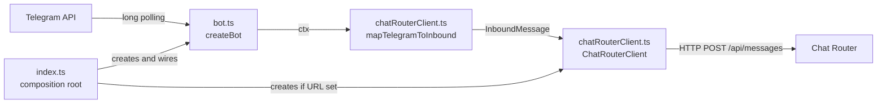
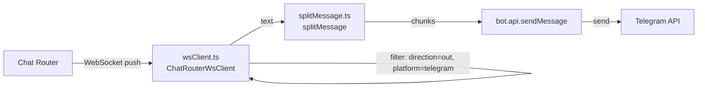
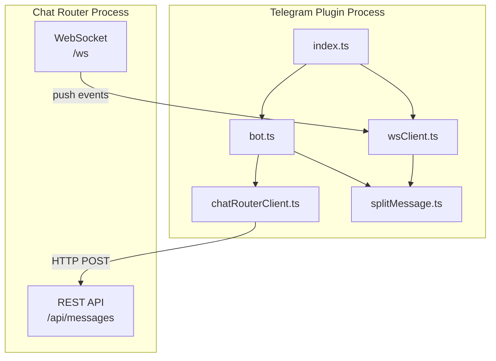

# Chat Router Plugin (Telegram): Architecture

## Plugin as a Separate Process

The Telegram plugin runs as its own Node.js process, completely independent of the chat router. This separation is intentional:

- The plugin can be started, stopped, and restarted without affecting the chat router or other plugins.
- The plugin only needs to know the chat router's HTTP URL, not its internal implementation.
- Multiple plugins (Telegram, Discord, Slack) can run simultaneously, each in its own process, all feeding into the same chat router.
- If a plugin crashes, the chat router and other plugins continue operating.

The plugin communicates with the chat router through two channels: inbound messages are sent via REST API (HTTP POST), and outbound messages are received via WebSocket push events. There are no shared dependencies, no shared database, and no in-process imports between the two packages.

The overall architecture is a **multi-process plugin architecture** where each plugin is a standalone process that communicates with the chat router over HTTP and WebSocket. It is not MVC, and not microservices. The plugin subscribes to real-time push events from the chat router for outbound message delivery. Within the plugin itself, the internal structure follows the design patterns described below.

## Design Patterns

The codebase employs five identifiable design patterns:

1. **Factory Function** -- `createBot(token, chatRouter?)` in `bot.ts` is a factory function. It constructs, configures, and returns a fully-wired `Bot` instance without starting it. The caller (`index.ts`) controls lifecycle separately. This is not a class with a constructor; it is a plain function that returns a configured object.

2. **Adapter / Mapper** -- `mapTelegramToInbound()` in `chatRouterClient.ts` is a structural adapter. It translates between two incompatible interfaces (grammY's `Context` and the chat router's `InboundMessage`). The mapper lives in the plugin, not in the chat router, so each platform plugin owns its own adapter. In DDD terminology, this also serves as an Anti-Corruption Layer, preventing Telegram-specific types from leaking into the chat router.

3. **HTTP Client Wrapper** -- `ChatRouterClient` in `chatRouterClient.ts` is a thin client class that encapsulates HTTP transport details (URL construction, fetch calls, error checking) behind a domain-specific interface (`ingestMessage`, `healthCheck`). This isolates the bot from transport concerns.

4. **Optional Dependency Injection** -- `createBot` accepts an optional `ChatRouterClient` parameter. When present, forwarding is active; when absent, forwarding is skipped. This is constructor-style DI (passed at creation time), not runtime DI. It produces two operating modes (standalone vs connected) without any conditional configuration files or feature flags.

5. **Composition Root / Entry Point** -- `index.ts` is the composition root. It reads environment variables, decides which dependencies to create, wires them together via the factory function, and starts the process. No business logic lives here. This is the only file that touches `process.env`, `process.exit`, or signal handlers.

## File Structure

```
telegram-integration/
  package.json              -- Project metadata, scripts (dev/build/start/test), dependencies
  src/
    index.ts                -- Composition root: reads env vars, wires dependencies, starts bot
    bot.ts                  -- Factory function createBot(): creates and configures grammY Bot
    chatRouterClient.ts     -- ChatRouterClient class (HTTP client) + mapTelegramToInbound() mapper
                               + InboundMessage interface (locally redeclared)
    wsClient.ts             -- ChatRouterWsClient class: WebSocket connection for outbound messages
    splitMessage.ts         -- splitMessage() utility: breaks long text at newline boundaries
    __tests__/
      bot.test.ts           -- 3 tests: Bot instance creation, handler registration, empty token
      chatRouterClient.test.ts -- 10 tests: mapper field-by-field validation with mock Context
      wsClient.test.ts      -- WebSocket client tests
      splitMessage.test.ts  -- 9 tests: edge cases for the splitting algorithm
```

## Data Flow

**Inbound flow (Telegram → Chat Router):**



**Outbound flow (Chat Router → Telegram):**



**Process boundaries:**



## Message Flow

**Inbound (Telegram → Chat Router):**

When a user sends a message to the Telegram bot:

1. grammY receives the message via long polling and invokes the message handler with a Context object.
2. The handler logs message details to the console (wall-clock timestamp, message ID, chat ID, chat type, sender info, message timestamp, text), plus the full raw message object as JSON.
3. If a ChatRouterClient is configured, the handler maps the grammY Context into the chat router's normalized InboundMessage format and sends it via HTTP POST. This runs for all message types, regardless of whether text is present.
4. If the message contains text, the handler splits it if necessary and echoes each chunk back as a Telegram reply.

Steps 3 and 4 are failure-independent: if forwarding fails, the echo still happens. However, they execute sequentially -- the echo does not begin until forwarding either completes or fails. See [Message Handler](implementation.md#message-handler) for the full step-by-step behavior.

**Outbound (Chat Router → Telegram):**

When the chat router produces an outbound message:

1. The chat router emits a message event on its WebSocket `/ws` endpoint.
2. The `ChatRouterWsClient` receives the event and filters for `direction: "out"`, `platform: "telegram"`, and non-null `text`.
3. If the message passes the filter, the client splits the text if necessary via `splitMessage()`.
4. Each chunk is delivered to Telegram via `bot.api.sendMessage(chatId, chunk)`.
5. Delivery errors are logged but do not disconnect the WebSocket; processing continues.

The WebSocket connection is established on plugin startup and reconnects automatically after 3 seconds if disconnected. See [Outbound Message Flow](implementation.md#outbound-message-flow) for implementation details.

## The Mapper Pattern

The mapper function (`mapTelegramToInbound`) is the translation layer between Telegram's data model and the chat router's normalized format. Each plugin owns its own mapper; the chat router never imports platform-specific types.

The mapper handles four categories of transformation: ID normalization (numeric to string), timestamp conversion (seconds to milliseconds), name construction (first/last name concatenation), and platform metadata extraction (chat title, username, bot flag). See [The Mapper Function](implementation.md#the-mapper-function) for the field-by-field transformation details.

## The grammY Bot

The plugin uses grammY, a Telegram Bot API framework for Node.js. It connects to Telegram using long polling, meaning the bot continuously asks Telegram's servers for new messages. This approach requires no inbound network configuration -- no webhook URL, no SSL certificate, no public-facing server.

The bot registers two handlers: a `/start` command handler and a general message handler. See [Command Handlers](implementation.md#command-handlers) and [Message Handler](implementation.md#message-handler) for details on what each handler does.

## Resilient Forwarding

The plugin has no startup dependency on the chat router. It can start before the chat router is running and will function normally in standalone echo mode until the chat router becomes available. Forwarding failures are isolated: if the HTTP request to the chat router fails for any reason, the error is logged and the bot continues processing. The two processes are failure-independent by design. See [Error Handling](implementation.md#error-handling) for the implementation mechanism.

## Message Splitting

Telegram imposes a 4096-character limit on message text. The `splitMessage` utility handles this by breaking long messages into chunks, preferring newline boundaries for readability. This utility is used when echoing messages back; it is not needed for forwarding to the chat router, which has no message length limit. See [The splitMessage Utility](implementation.md#the-splitmessage-utility) for the algorithm steps.

## Configuration and Modes

The plugin's behavior is controlled by two environment variables:

| Environment Variable | Required | Description |
|---|---|---|
| BOT_TOKEN | Yes | Telegram bot token from BotFather. Without it, the process exits immediately with an error message. |
| CHAT_ROUTER_URL | No | Base URL of the chat router REST API (e.g., `http://localhost:3100`). Its presence or absence determines the operating mode. |

**Connected mode**: When `CHAT_ROUTER_URL` is set, the plugin creates an HTTP client and forwards all messages to the chat router.

**Standalone mode**: When `CHAT_ROUTER_URL` is absent, the plugin operates as a simple echo bot with no chat router interaction.

The mode is determined at startup and logged to the console. There is no runtime switching between modes.
