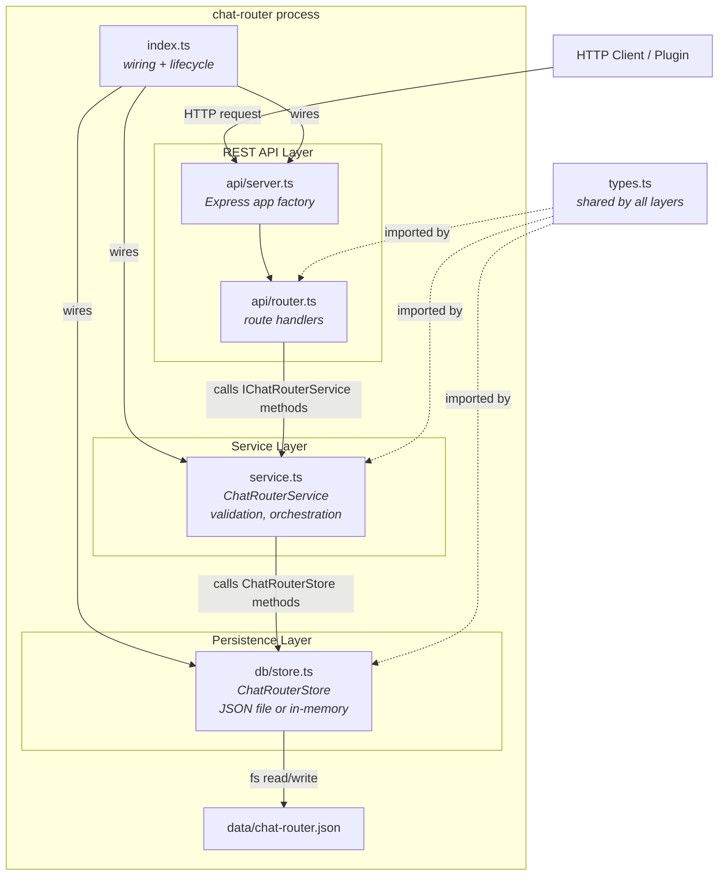

# Chat Router System: Architecture

## Design Pattern: Layered Architecture with Service Layer

The chat router follows a **Layered Architecture** organized around a central **Service Layer** (also known as the Application Service pattern). The service layer contains all business logic and defines a contract (`IChatRouterService`) that transport adapters implement against. Transport adapters (REST today, Daemon CLI and WebSocket planned) are thin translation layers that convert protocol-specific requests into service method calls. The persistence layer (`ChatRouterStore`) is injected into the service, making it swappable.

This pattern is sometimes described as a simplified Hexagonal Architecture: the service interface is the primary port, transport adapters are driving adapters, and the store is a driven adapter. Dependencies flow strictly downward -- the REST API depends on the service, the service depends on the store, and all layers depend on the shared type definitions. No layer reaches upward.

## File Structure

```
chat-router/
  package.json              -- Package manifest; defines dev, build, start, test scripts
  src/
    index.ts                -- Entry point; wires Store -> Service -> Server, calls listen(), handles shutdown
    types.ts                -- All shared types and the IChatRouterService interface contract
    service.ts              -- ChatRouterService class; all business logic (implements IChatRouterService)
    db/
      store.ts              -- ChatRouterStore class; JSON-file-backed persistence (or in-memory for tests)
    api/
      server.ts             -- createServer() factory; creates Express app, mounts JSON parser and API router
      router.ts             -- createApiRouter() factory; maps HTTP endpoints to IChatRouterService methods
    __tests__/
      store.test.ts         -- 9 tests for the persistence layer
      service.test.ts       -- 12 tests for the business logic layer
      api.test.ts           -- 12 tests for the HTTP adapter layer
```

## Architectural Diagram



## Layered Design

The four layers and their responsibilities:

1. **Types** (`types.ts`) -- Defines all data structures (`InboundMessage`, `TimelineEntry`, `OutboundMessage`, `Conversation`) and the service interface contract (`IChatRouterService`). Every other layer imports from types, but types import nothing.

2. **Persistence** (`db/store.ts`) -- Reads and writes timeline entries and conversations. The current implementation is backed by a JSON file; it is designed to be swappable for SQLite without changing any other layer. The store interface exposes the same method signatures regardless of backing storage. See [Implementation Details](implementation.md#store-internals) for internal mechanics.

3. **Service** (`service.ts`) -- All business logic. Validates inputs, transforms inbound messages into the internal data shape, orchestrates store operations, and provides the seven methods defined by `IChatRouterService`. This is the source of truth for the system's behavior.

4. **REST API** (`api/server.ts`, `api/router.ts`) -- A thin Express-based HTTP adapter that translates HTTP requests into service method calls. Contains no business logic. The `createServer()` factory returns an Express app without calling `.listen()`, keeping it testable with supertest. The entry point (`index.ts`) calls `.listen()` and handles graceful shutdown on SIGINT/SIGTERM.

## Data Flow

When a message arrives via the REST API:

1. The Express router receives the HTTP request and parses the JSON body.
2. The router calls the corresponding service method (e.g., `ingestMessage`).
3. The service validates the input and transforms it into the internal data shape.
4. The service calls the store's `ingestTransaction`, which inserts a timeline entry and upserts the conversation record.
5. The store assigns an auto-increment ID and persists to disk.
6. The completed `TimelineEntry` is returned up through the layers to the HTTP response.

Outbound responses follow the same path through `recordResponse`, with direction set to `"out"` and a synthetic platform message ID generated by the service.

Query operations (timeline retrieval, conversation listing) follow the same layered path: the REST router parses query parameters, calls the appropriate service method, which delegates to the store, and the result is returned as JSON.

## Normalized Message Model

All messages are normalized to a common format regardless of which platform they came from.

**InboundMessage** is what plugins send to the chat router. It contains the platform identifier, platform-specific message and chat IDs (as strings to accommodate different platforms), sender information, optional message text, a millisecond Unix timestamp, and an optional `platformMeta` bag for preserving platform-specific data.

**TimelineEntry** is the persisted form. It adds an auto-increment ID, a direction field (`"in"` or `"out"`), and an ISO 8601 `createdAt` timestamp. The `platformMeta` is serialized to a JSON string for storage. This is what all query methods return.

**OutboundMessage** represents a response that should be delivered back to a platform. It contains the timeline entry ID, target platform and chat ID, response text, and an optional `inReplyTo` reference to the timeline entry being replied to.

**Conversation** tracks unique `(platform, platformChatId)` pairs. It is created automatically when the first message from a new chat is ingested. It stores a display label, a `platformChatType` (e.g., `"private"`, `"group"`), first-seen and last-message timestamps, and a running message count. Conversations are never explicitly created or deleted by API callers.

## Platform Abstraction

The system defines three platform types: `"telegram"`, `"discord"`, and `"web"`. All platform-specific data is carried in two places:

- **`platformChatType`** captures platform-specific chat classifications (e.g., Telegram's `"private"`, `"group"`, `"supergroup"`).
- **`platformMeta`** is a freeform JSON bag where plugins can stash any platform-specific data they want preserved (e.g., Telegram's full User object, Discord guild information).

The chat router never interprets `platformMeta`. It stores and returns it as-is. This means new platform-specific fields can be added without any changes to the chat router code.
