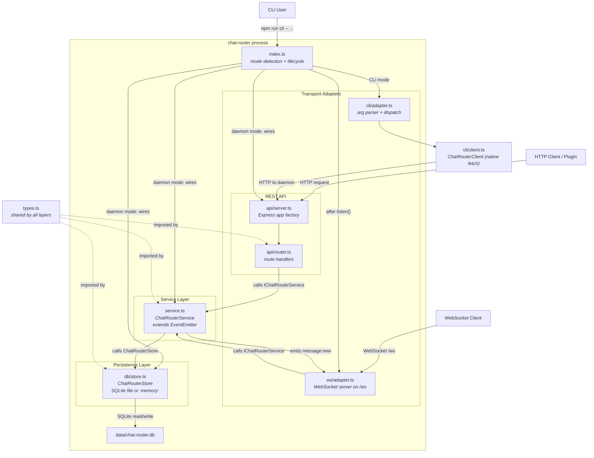

# Chat Router System: Architecture

## Design Pattern: Layered Architecture with Service Layer

The chat router follows a **Layered Architecture** organized around a central **Service Layer** (also known as the Application Service pattern). The service layer contains all business logic and defines a contract (`IChatRouterService`) that transport adapters implement against. Three transport adapters (REST, CLI, and WebSocket) are thin translation layers that convert protocol-specific requests into service method calls. The persistence layer (`ChatRouterStore`) is injected into the service, making it swappable.

Dependencies flow strictly downward -- the transport adapters depend on the service, the service depends on the store, and all layers depend on the shared type definitions. No layer reaches upward. The one exception is the event-driven link: `ChatRouterService` extends `EventEmitter` and emits `"message:new"` events, which the WebSocket adapter subscribes to for real-time push.

## File Structure

```
chat-router/
  package.json              -- Package manifest; defines dev, build, start, test, cli scripts
  src/
    index.ts                -- Entry point; CLI mode detection (process.argv) or daemon startup (Store -> Service -> Server -> WebSocket)
    types.ts                -- All shared types and the IChatRouterService interface contract
    service.ts              -- ChatRouterService class; extends EventEmitter, implements IChatRouterService
    db/
      store.ts              -- ChatRouterStore class; SQLite-backed persistence via better-sqlite3 (or :memory: for tests)
    api/
      server.ts             -- createServer() factory; creates Express app, mounts CORS middleware, JSON parser, API router, and global error handler
      router.ts             -- createApiRouter() factory; maps HTTP endpoints to IChatRouterService methods
    cli/
      adapter.ts            -- CLI mode detection and command dispatch; custom arg parser (no external deps)
      client.ts             -- ChatRouterClient; HTTP client using native fetch, talks to running daemon
    ws/
      adapter.ts            -- WebSocket server adapter; attaches to HTTP server at /ws via the ws library
      protocol.ts           -- TypeScript types for the WebSocket JSON protocol (WsRequest, WsResponse, WsPush, WsError)
    acs/
      trigger.ts            -- ACS job trigger module; builds prompt and POSTs to ACS on inbound messages
    scripts/
      seed.ts               -- Inserts fake Telegram messages via the service layer (npm run seed)
      query.ts              -- Queries the running chat router via HTTP REST API (npm run query)
    __tests__/
      store.test.ts         -- 16 tests for the persistence layer
      service.test.ts       -- 16 tests for the business logic layer
      api.test.ts           -- 13 tests for the HTTP adapter layer
      cli.test.ts           -- Tests for the CLI adapter
      ws.test.ts            -- Tests for the WebSocket adapter
```

## Configuration

The entry point reads environment variables via `dotenv` (from `.env` file) in daemon mode:

- **`CHAT_ROUTER_PORT`** -- TCP port for the HTTP server (default: `3100`).
- **`CHAT_ROUTER_DATA_DIR`** -- Directory for the SQLite database file (default: `./data`).
- **`ACS_JOB_NAME`** -- ACS job to trigger on inbound messages (optional; omit to disable auto-triggering).
- **`ACS_URL`** -- Base URL of the ACS service (default: `http://127.0.0.1:8377`).
- **`ROUTER_SELF_URL`** -- Public URL of the router, passed to the agent so it can curl responses back (default: `http://localhost:{PORT}`).

The CLI adapter and the Telegram integration both read:

- **`CHAT_ROUTER_URL`** -- Base URL of the running daemon (default: `http://localhost:3100`). Used by the CLI client and by `telegram-integration` to connect to the chat router over HTTP.

## Architectural Diagram



## Layered Design

The layers and their responsibilities:

1. **Types** (`types.ts`) -- Defines all data structures (`InboundMessage`, `TimelineEntry`, `OutboundMessage`, `Conversation`) and the service interface contract (`IChatRouterService`). Every other layer imports from types, but types import nothing.

2. **Persistence** (`db/store.ts`) -- Reads and writes timeline entries and conversations. The current implementation is backed by SQLite via better-sqlite3. It uses WAL journal mode for file-based databases and `:memory:` mode for tests. The store also exposes a `getStats()` method returning aggregate message and conversation counts used by the health check endpoint. The store interface is designed so that the backing storage could be swapped without changing any other layer. See [Implementation Details](implementation.md#store-internals) for internal mechanics.

3. **Service** (`service.ts`) -- All business logic. Validates inputs, transforms inbound messages into the internal data shape, orchestrates store operations, and provides the seven methods defined by `IChatRouterService`. The service extends `EventEmitter` and emits `"message:new"` after both `ingestMessage` and `recordResponse`, providing the observable event stream that powers WebSocket real-time push.

4. **Transport Adapters** -- Three thin adapters translate protocol-specific requests into `IChatRouterService` method calls. None contain business logic.
   - **REST API** (`api/server.ts`, `api/router.ts`) -- Express-based HTTP adapter. `createServer()` configures CORS, JSON parsing, request logging middleware, the API router, and a global error handler, then returns the Express app without calling `.listen()`, keeping it testable with supertest. When `AcsTriggerConfig` is provided, the `POST /api/messages` endpoint triggers an ACS job after ingesting each inbound message.
   - **ACS Integration** (`acs/trigger.ts`) -- Optional auto-trigger module. When enabled via `ACS_JOB_NAME`, the REST API calls `triggerAcsJob()` after ingesting each inbound message (before returning 201). The module builds a single-line prompt containing router URL, platform, chat ID, and message text, then POSTs to the ACS trigger endpoint. Trigger failures are logged but do not block the ingest response.
   - **CLI** (`cli/adapter.ts`, `cli/client.ts`) -- Detects CLI mode via `isCliCommand(process.argv[2])`. Dispatches to a `ChatRouterClient` that calls the running daemon's REST API using native `fetch` (no external HTTP library). Supports commands: `health`, `conversations`, `timeline`, `ingest`, `respond`. Invoked via `npm run cli -- <command> [args]`.
   - **WebSocket** (`ws/adapter.ts`, `ws/protocol.ts`) -- Attaches a `WebSocketServer` (from the `ws` library) to the HTTP server at path `/ws` after `app.listen()`. Supports four read-only request types (`health`, `conversations`, `timeline`, `unified_timeline`). Broadcasts `new_message` push events to all connected clients when the service emits `"message:new"`.

The entry point (`index.ts`) handles mode detection and lifecycle: in CLI mode it runs the command and exits; in daemon mode it wires Store, Service, and Server, builds the optional `AcsTriggerConfig` from environment variables, calls `.listen()`, attaches the WebSocket adapter, and handles graceful shutdown on SIGINT/SIGTERM (closing the HTTP server and database connection). File logging is configured at startup, tee-ing all `console.log` and `console.error` output to both stdout and `logs/chat-router.log` with ISO 8601 timestamps.

## Data Flow

**REST API path** -- When a message arrives via HTTP:

1. The Express router receives the HTTP request and parses the JSON body.
2. The router calls the corresponding service method (e.g., `ingestMessage`).
3. The service validates the input and transforms it into the internal data shape.
4. The service calls the store's `ingestTransaction`, which wraps a timeline entry insert and conversation upsert in a SQLite transaction (atomic). SQLite assigns an auto-increment ID during the insert.
5. The service emits `"message:new"` with the completed entry (triggering WebSocket broadcast).
6. If `AcsTriggerConfig` is provided, the ACS module builds a prompt and POSTs to the ACS job trigger endpoint. The trigger is awaited but failures are logged, not fatal.
7. The completed `TimelineEntry` is returned up through the layers to the HTTP response.

Outbound responses follow the same path through `recordResponse`, with direction set to `"out"`. The service sets senderName to `"System"`, senderId to `"system"`, and generates a synthetic platform message ID in the format `router-N` using an in-memory counter.

**CLI path** -- The CLI adapter parses arguments, instantiates a `ChatRouterClient` configured via `CHAT_ROUTER_URL`, and makes HTTP requests to the running daemon's REST API. The daemon processes them identically to any other HTTP client. The `ingest` and `respond` commands accept `--json` flag or read JSON from stdin.

**WebSocket query path** -- A connected client sends a JSON request frame (e.g., `{"type":"timeline","platform":"telegram","platformChatId":"123"}`). The adapter's `handleRequest` dispatches to the appropriate service method and sends the response back on the same connection.

**WebSocket push path** -- When the service emits `"message:new"`, the WebSocket adapter broadcasts a `WsPush` frame (`{"type":"new_message","entry":{...}}`) to all connected clients. This provides real-time notification without polling.

Query operations (timeline retrieval, conversation listing) follow the same layered path regardless of transport: parse parameters, call the service method, delegate to the store, return the result. The unified timeline (`GET /api/timeline`) returns entries across all platforms. Timeline queries support cursor-based pagination via `after` (entries with id > value) and `before` (entries with id < value) parameters. The default page size is 50 entries, ordered by ID descending (newest first).

## Cross-System Integration

The Telegram integration plugin (`telegram-integration`) performs an async health check against the chat router at startup. If the health check fails, it logs a warning but does not block bot startup ("warn but don't block" pattern). This means the bot remains functional even when the chat router is temporarily unavailable.

The chat router can optionally trigger ACS jobs on inbound messages. When `ACS_JOB_NAME` is set, the router constructs an `AcsTriggerConfig` at startup and passes it to the API router. After each inbound message is persisted, the router builds a single-line prompt and POSTs to the ACS trigger endpoint. The 201 response is held until the trigger completes, so downstream clients (e.g., the Telegram plugin's thumbs-up reaction) confirm that the agent job was kicked off, not just that the message was stored.

## Normalized Message Model

All messages are normalized to a common format regardless of which platform they came from.

**InboundMessage** is what plugins send to the chat router. It captures platform origin, sender identity, message content, and an optional `platformMeta` bag for preserving platform-specific data. All IDs are strings to accommodate different platforms. See `types.ts` for the full field list.

**TimelineEntry** is the persisted form. It adds an auto-increment ID, a direction field (`"in"` or `"out"`), and an ISO 8601 `createdAt` timestamp. The `platformMeta` is serialized to a JSON string for storage. This is what all query methods return.

**OutboundMessage** is defined in `types.ts` as a future-use type for responses delivered back to a platform; it is not currently referenced outside of `types.ts`.

**Conversation** tracks unique `(platform, platformChatId)` pairs with timestamps and a running message count. Each conversation is assigned an auto-increment ID. Conversations are created automatically when the first message from a new chat is ingested and are never explicitly created or deleted by API callers.

## Platform Abstraction

The system defines three platform types: `"telegram"`, `"discord"`, and `"web"`. All platform-specific data is carried in two places:

- **`platformChatType`** captures platform-specific chat classifications (e.g., Telegram's `"private"`, `"group"`, `"supergroup"`).
- **`platformMeta`** is a freeform JSON bag where plugins can stash any platform-specific data they want preserved (e.g., Telegram's full User object, Discord guild information).

The chat router never interprets `platformMeta`. It stores and returns it as-is. This means new platform-specific fields can be added without any changes to the chat router code.

## Dependencies

Runtime: `express`, `better-sqlite3`, `cors`, `ws` (^8.19.0), `dotenv`. Dev: `vitest`, `supertest`, `tsx`, `typescript`, and associated `@types/*` packages.
